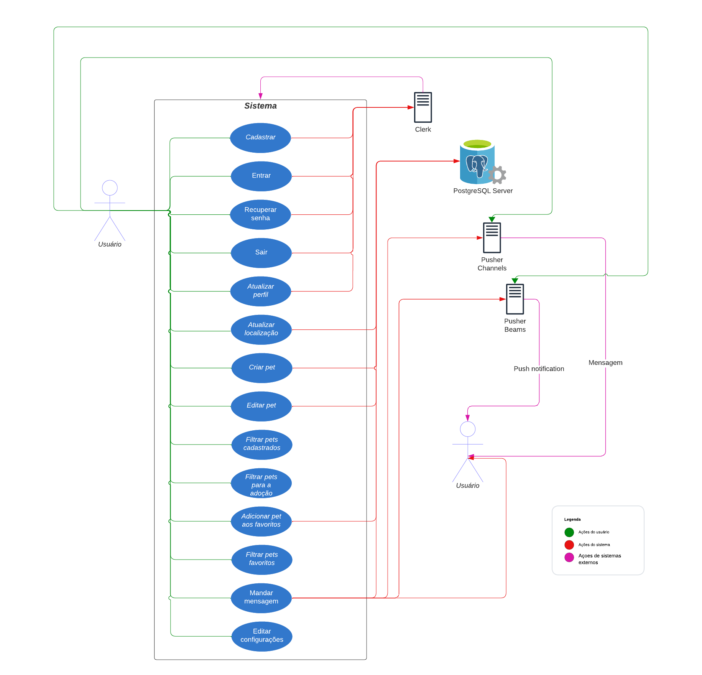
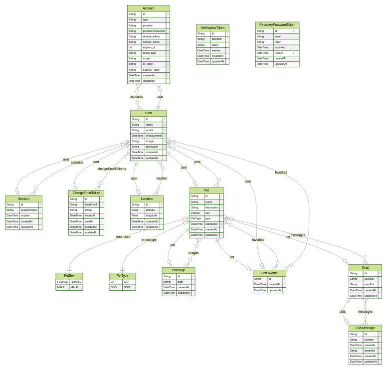

# Minhau - App

App para adoção de cães e gatos para meu projeto de TCC.

Feito utilizando tecnologias Javascript como [Next.js](https://nextjs.org/), [Prisma](https://www.prisma.io) e [React](https://react.dev) entre outras utilizando vários conceitos aprendido durante o curso como desenvolvimento web, banco de dados, algoritmos e mais.

## Tecnologias
  - [Next.js](https://nextjs.org/)
  - [Vercel](https://vercel.com/)
  - [Prisma](https://www.prisma.io)
  - [React](https://react.dev)
  - [Postgres](https://www.postgresql.org/)
  - [Redis](https://redis.io/)
  - [NextAuth.js](https://next-auth.js.org/)
  - [Socket.io](https://socket.io/)
  - [Sentry](https://sentry.io)
  - [Render](https://render.com/)

## Diagrama de casos de uso


## Diagrama de banco de dados


## Modificando

Primeiramente inicie os bancos de dados:

```bash
docker-compose up
```

⚠️ Antes de prosseguir inicialize o [*servidor websocket*](https://github.com/jonatanbortolon/minhau-websocket-server).

Instale as dependências

```bash
npm i
# or
yarn
# or
pnpm i
```

e rode o servidor de desenvolvimento:


```bash
npm run dev
# or
yarn dev
# or
pnpm dev
```

Abra a url [http://localhost:3000](http://localhost:3000) no seu navegador para ver o resultado.

Você pode começar a editar os arquivos do projeto. A pagina atualiza conforme você modifica os arquivos.

## Hospedando o projeto

Você pode hospedar o projeto de diferentes maneiras, na documentação do Next.js possui uma seção específica para deploy: https://nextjs.org/docs/app/building-your-application/deploying

## Construindo o app Android

Primeiro passo é assinar seu app, crie uma keystore dentro da pasta twa https://developer.android.com/studio/publish/app-signing?hl=pt-br

Após execute o comando ```npm run build-android``` para gerar os executáveis.
